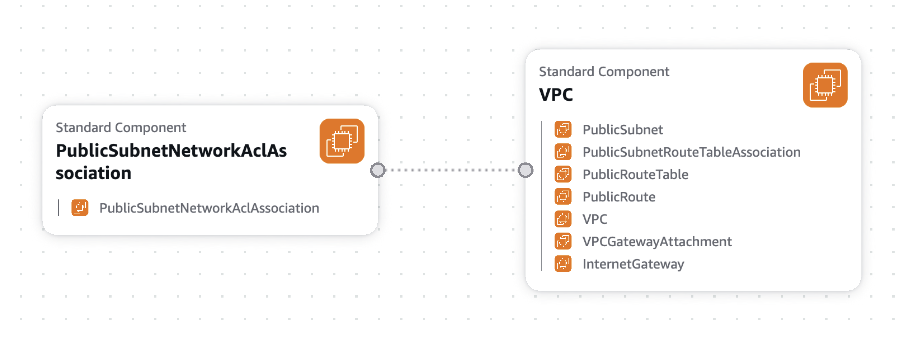
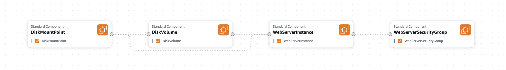
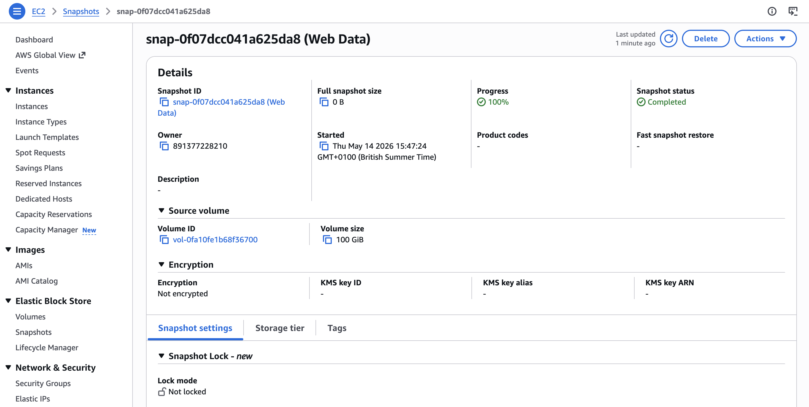
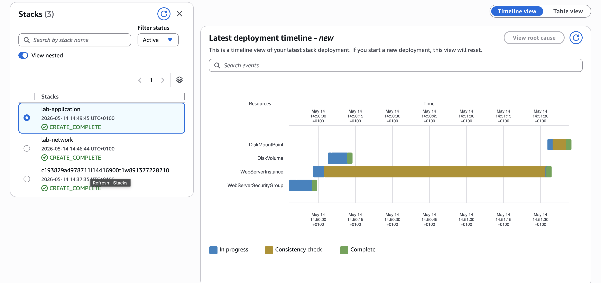
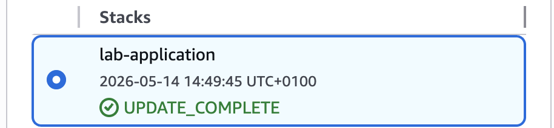

# AWS CloudFormation Infrastructure Automation Lab

In the lab I deplyed a networking layer and application layer using reusable CloudFormation templates, while also condicting stack updates, infrastructure visualisation, and resource lifecycle management. This project demonstrates Infrastructure as Code (IaC) concepts using AWS CloudFormation.

## Architecture

### Network Diagram

### Application Diagram

## Technologies Used

- AWS CloudFormation
- Amazon VPC
- Amazon EC2
- Security Groups
- AWS Infrastructure Composer
- Amazon EBS

## Key Tasks Completed

- Deployed a VPC networking layer using CloudFormation
- Created an EC2 application layer referencing exported stack values
- Updated infrastructure by modifying stack templates
- Added HTTPS access through security group updates
- Explored templates using AWS Infrastructure Composer
- Implemented EBS snapshot retention with DeletionPolicy

## Concepts Learned

### Infrastructure as Code (IaC)

Infrastructure as Code (IaC) enables cloud infrastructure to be deployed through reusable templateshelping save time when it comes to manual configuation. In this lab, AWS CloudFormation templates were used to provision networking and application resources automatically. This approach improves consistency, reduces the risk of configuration drift and allows infrastructure to be versioned similarly to application code. IaC also makes deployments more scalable and repeatable across development, testing, and production environments.

### Stack Outputs and Imports

CloudFormation outputs were used to share resource values between multiple infrastructure stacks. The networking stack exported values such as the VPC ID and subnet ID, which were then imported into the application stack using Fn::ImportValue. It displayed how infrastructure can be separated into reusable layers while still maintaining communication between stacks. 
Change Sets and Stack Updates

### Change Sets and Stack Updates

AWS CloudFormation supports updating infrastructure stacks without rebuilding the entire environment. In this lab, the application stack was updated by replacing the original template with a modified version that added HTTPS access to the security group. CloudFormation generated a change set preview before deployment, showing which resources would be modified and whether replacement was required. This process demonstrated how infrastructure changes can be managed in a controlled, predictable, and repeatable manner.

### Resource Lifecycle Management

There was a Deletion Policy within the application stack for a snapshot to be taken of an Amazon Elastic Block Store (Amazon EBS) disk volume before it is deleted. Such policies can prove useful when it comes to retaining databases or other resources that may be needed after the stack is deleted. Additionally, it can help prevent the accidental deletion of specific resources.
Deletion policies can preserve important resources such as EBS snapshots after stack deletion.

### CloudFormation Stack

## Key Takeaways

This project improved my understanding of AWS CloudFormation, infrastructure automation, and layered cloud architecture. It also demonstrated the benefits of repeatable deployments and infrastructure versioning.
